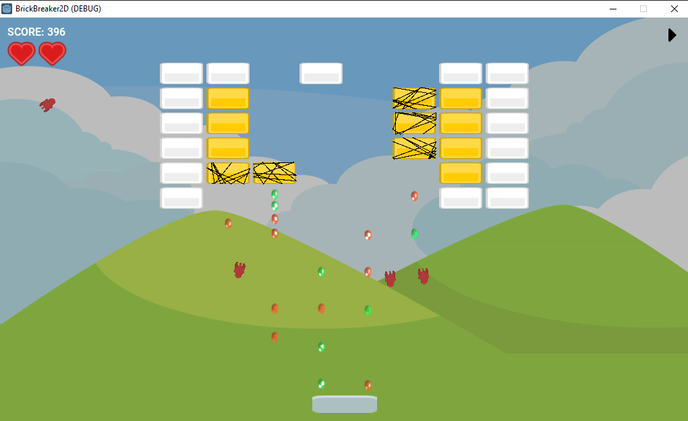
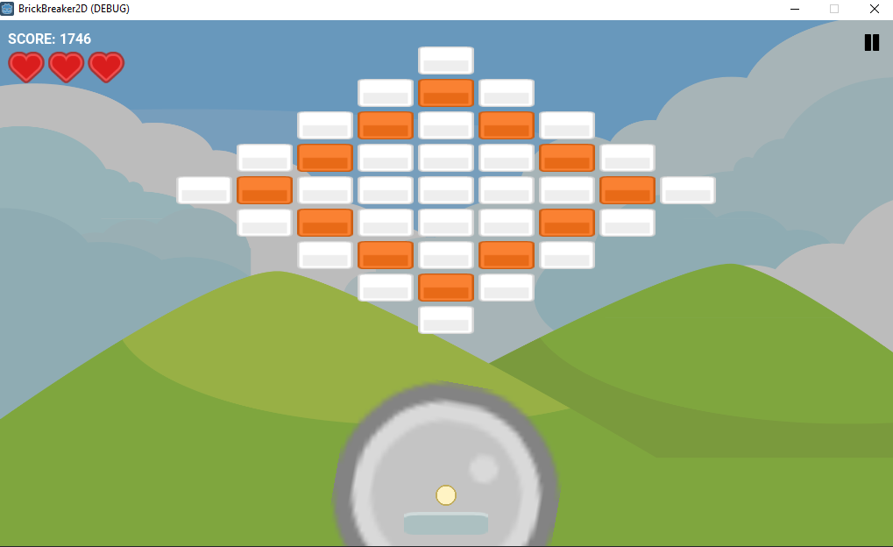
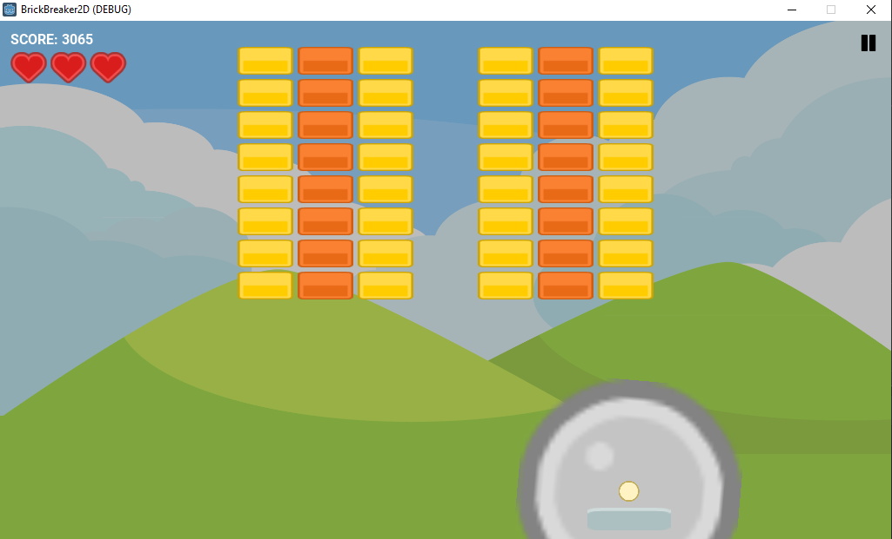
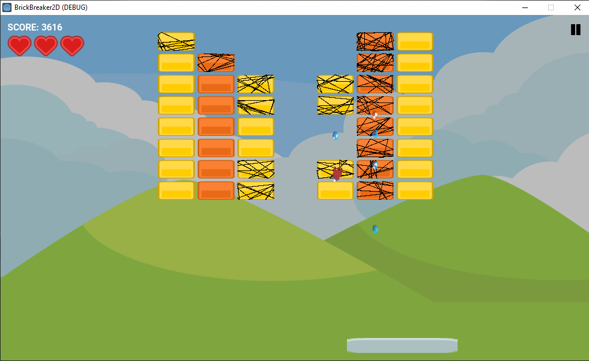

# BrickBreaker2D:

Created the brick breaker game in Godot 3.2.

This is a great game to create as a stepping stone to learn how to work within the Godot environment

To run the project, download/clone and run from Godot's editor.

## Future Planned Upgrades
- [x] Add Score.
- [x] Add lives.
- [ ] Create walls inside the screen view.
- [ ] Add more powerups.
	- [ ] Ball speed.
	- [ ] Paddle shooting.
	- [ ] Big ball.
	- [ ] Small paddle.
	- [ ] Go through side walls.
	- [ ] Plant bombs near the brick.
	- [X] Increase/Decrease lives.
- [X] Set different levels.
- [ ] Animation of brick being shattered. (temporarily i'm drawing a scribble on the hit brick)

And many more original and unique improvements on the basic known game.

## Exisiting powerups:

- **paddle_expand** - Paddle expands do X2 original size.
- **powerup_rocket** - Ball rockets through bricks.
- **extra_life** - User gets an extra life.

##  Images:

- **root hierarchy** -

